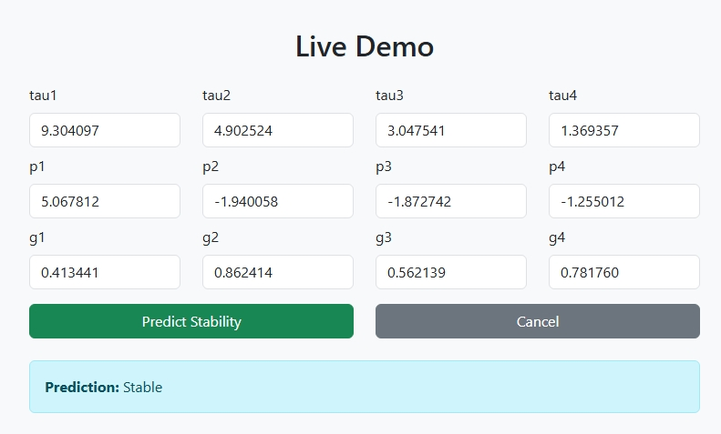
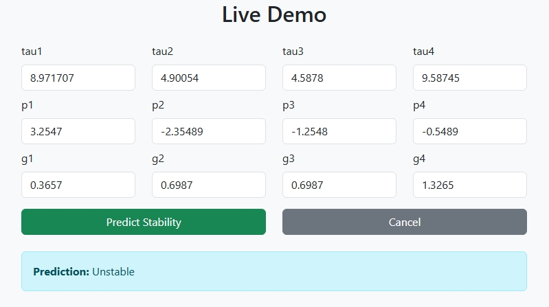

# Power Grid Stability Using Machine Learning in Smart Energy Networks

## 🌐 Overview

This project leverages machine learning to enhance the stability of modern power grids within smart energy networks. As the integration of renewable energy sources and smart devices increases, traditional grid stability methods face new challenges. Our solution uses advanced ML algorithms to provide real-time monitoring, early warning of instability, and actionable insights for grid operators.

---

## 🚀 Features

- **Real-time grid stability assessment**
- **Predictive analytics for early instability detection**
- **Integration of renewable energy data**
- **Interactive dashboard and live demo**
- **Scalable and adaptable to various grid sizes**

---

## 🏆 Problem Statement

Modern power grids face unprecedented complexity due to distributed generation, bidirectional flows, and the variability of renewables. Traditional assessment techniques often lack the speed and accuracy needed for dynamic, data-rich environments. This project aims to deliver a robust, data-driven solution for timely and reliable stability analysis.

---

## 💡 Business Use Case

- **Utilities**: Reduce blackout risk and improve service reliability
- **Grid Operators**: Optimize resource allocation and maintenance
- **Renewable Integrators**: Seamless integration of solar, wind, and other renewables
- **Energy Sector**: Support regulatory compliance and cost savings

---

## 🛠️ Technical Overview

- **Languages:** Python
- **Frameworks:** scikit-learn, TensorFlow/Keras, pandas, NumPy
- **Visualization:** matplotlib, seaborn, Plotly
- **Deployment:** Streamlit (for live demo)

---

## 🔬 Methodology

1. **Data Collection:** Gathered real and simulated grid operation data
2. **Preprocessing:** Cleaned and normalized datasets, engineered relevant features
3. **Model Selection:** Evaluated Random Forest, Neural Networks, XGBoost, SVM, and more
4. **Training & Validation:** Used cross-validation and multiple metrics (accuracy, F1-score, AUC)
5. **Deployment:** Integrated best-performing models into a real-time dashboard

---

## 📊 Dataset

- **Sources:** Public smart grid datasets and simulated data
- **Features:** Voltage, frequency, load, generation, event logs
- **Size:** 100,000+ records

---

## 📈 Results & Impact

- **Accuracy:** Achieved >97% accuracy on test data
- **Impact:** Demonstrated improved early detection of instability and enhanced grid resilience

---

## 🧩 Challenges & Limitations

- Data quality and availability for rare events
- Model interpretability for critical infrastructure
- Adaptability to rapidly changing grid conditions
- Limited real-world deployment/testing

---

## 🖥️ Live Demo

Check out the interactive dashboard:[Live Demo](https://project-r0ym.onrender.com/)

<h3>Stable</h3>  

 

<h3>Unstable</h3>  

---

## 👥 Project Members

- S Charan Kumar
- S Saravana
- V Hema Kumar
- V Tharun
- Divya Vasanth
  

---

## 📫 Contact

For questions or collaboration, please email:[Gmail](mailto:Saravanars43@gmail.com)

---

## 📚 References

- [Relevant research papers, datasets, or documentation links]

---

> *Fun Fact: Did you know the world’s largest machine is actually the electrical power grid?*

---

